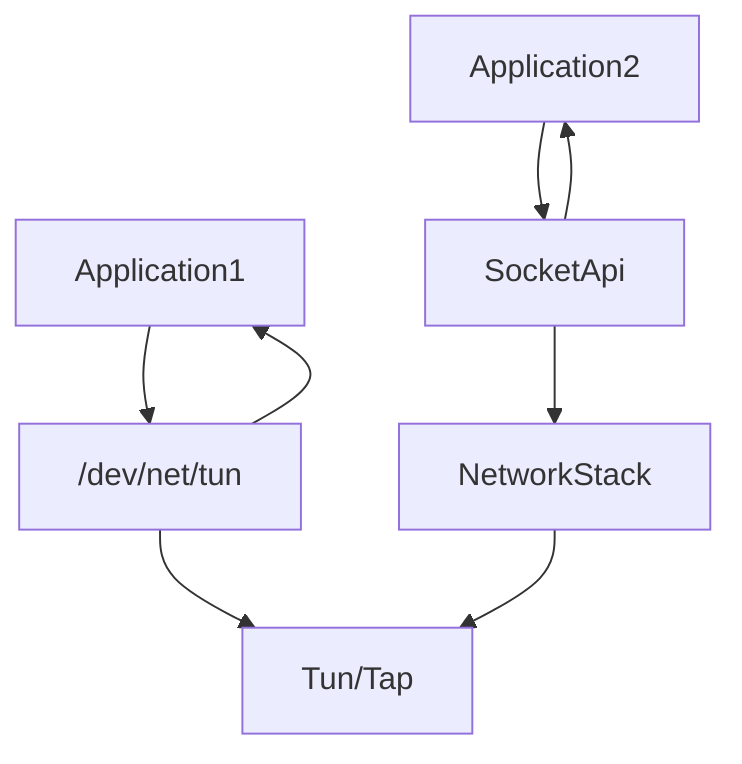
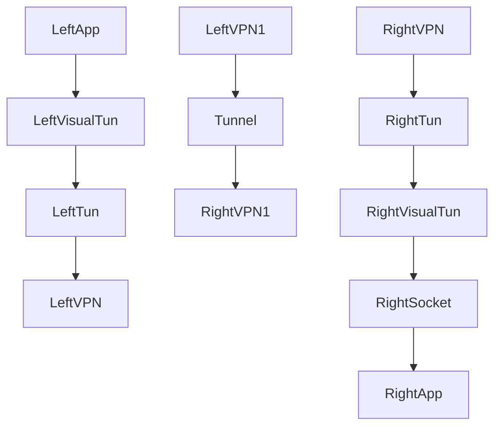

# Linux Tun/Tap 介绍
Introduce to Linux Tun/Tap

## 什么是Tun/Tap
What is Tun/Tap

在计算机网络中，TUN与TAP是操作系统内核中的虚拟网络设备。不同于普通靠硬件网路板卡实现的设备，这些虚拟的网络设备全部用软件实现，并向运行于操作系统上的软件提供与硬件的网络设备完全相同的功能。

In computer networks, Tun and Tap are visual network devices in the operating ststem kernal. Diferent from the common hardware network card devices, these visual network devices are all implemented by software and provide the software running on the operating system with the same functions as the hardware newwork devices.

TAP等同于一个以太网设备，它操作第二层数据包如以太网数据帧。TUN模拟了网络层设备，操作第三层数据包比如IP数据封包。

A TAP is equivalent to an Ethernet device that manipulates layer 2 packets such as Ethernet data frames. TUN simulates network layer devices and operates layer 3 packets such as IP data packets.

操作系统通过TUN/TAP设备向绑定该设备的用户空间的程序发送数据，反之，用户空间的程序也可以像操作硬件网络设备那样，通过TUN/TAP设备发送数据。
The operating system sends data through the TUN/TAP device to the user-space programs bound to the device. Conversely, the user-space programs can also send data through the TUN/TAP device just they would on a hardware network device.
在后种情况下，TUN/TAP设备向操作系统的网络栈投递（或“注入”）数据包，从而模拟从外部接受数据的过程。
In the latter case, TUN/TAP devices deliver(or inject) packets to operating system's newwork stack, thus simulates the process of receiving data from outside.

## 应用程序如何操作Tun/Tap
How does an application operate Tun/Tap

Linux Tun/Tap驱动程序为应用程序提供了两种交互方式：虚拟网络接口和字符设备/dev/net/tun。
The Linux Tun/Tap driver provides two ways for applications to interact: the visual newwork interface and character device /dev/net/tun.
写入字符设备/dev/net/tun的数据会发送到虚拟网络接口中；发送到虚拟网络接口中的数据也会出现在该字符设备上。
The data written to the character device dev/net/tun is sent to the visual network interface; Data sent to the visual network interface also appears on the character device.

应用程序可以通过标准的Socket API向Tun/Tap接口发送IP数据包，就好像对一个真实的网卡进行操作一样。
Applications can send IP packets to Tun/Tap interface through the standard Socket API as if they were operating on a real NIC.
除了应用程序以外，操作系统也会根据TCP/IP协议栈的处理向Tun/Tap接口发送IP数据包或者以太网数据包，例如ARP或者ICMP数据包。
In addition to applications, the operating system also sends IP packets or Ethernet packets, such as ARP or ICMP packets, to Tun/Tap interface based on TCP/IP stack processing.
Tun/Tap驱动程序会将Tun/Tap接口收到的数据包原样写入到/dev/net/tun字符设备上，处理Tun/Tap数据的应用程序如VPN程序可以从该设备上读取到数据包，以进行相应处理。
The Tun/Tap driver writes the original packets received by the Tun/Tap interface to /dev/net/tun character device. Applications that process Tun/Tap data, such as VPN programs, can read and process the data packets from the device.

应用程序也可以通过/dev/net/tun字符设备写入数据包，这种情况下该字符设备上写入的数据包会被发送到Tun/Tap虚拟接口上，进入操作系统的TCP/IP协议栈进行相应处理，就像从物理网卡进入操作系统的数据一样。
The application program can also write data packets through the /dev/net/tun character device. In this case, the data packets written on the character device are sent to Tun/Tap visual interface, and processed by operating system's TCP/IP stack, just like data packets sent to the operating stystem from a physical NIC.

Tun虚拟设备和物理网卡的区别是Tun虚拟设备是IP层设备，从/dev/net/tun字符设备上读取的是IP数据包，写入的也只能是IP数据包，因此不能进行二层操作，如发送ARP请求和以太网广播。
The difference between a Tun visual device and a physical NIC is that the Tun visual device is an IP layer device. The TUN visual device can only read or write IP packets from /dev/net/tun character device. Therefore, it can't perform layer 2 operations, such as sending ARP requests and broadcasting over the Ethernet.
与之相对的是，Tap虚拟设备是以太网设备，处理的是二层以太网数据帧，从/dev/net/tun字符设备上读取的是以太网数据帧，写入的也只能是以太网数据帧。从这点来看，Tap虚拟设备和真实的物理网卡的能力更接近。
In contrast, the Tap visual device is an Ethernet device that processes layer 2 Ethernet data frames. The Tap visual device can only read and write Ethernet date frames from /dev/net/tun character device. From this point of view, the Tap visual device is much closer to capabilities of a real physical network adapter.

## 使用Tun/Tap创建点对点隧道
Create point-to-point tunnel by Tun/Tap

通过应用程序从/dev/net/tun字符设备中读取或者写入数据看上去并没有太大用处，但通过将Tun/Tap结合物理网络设备使用,我们可以创建一个点对点的隧道。
如下图所示，左边主机上应用程序发送到Tun虚拟设备上的IP数据包被VPN程序通过字符设备接收，然后再通过一个TCP或者UDP隧道发送到右端的VPN服务器上，VPN服务器将隧道负载中的原始IP数据包写入字符设备，这些IP包就会出现在右侧的Tun虚拟设备上，最后通过操作系统协议栈和socket接口发送到右侧的应用程序上。

## Reference

- [Linux Tun/Tap 介绍](https://www.zhaohuabing.com/post/2020-02-24-linux-taptun/)